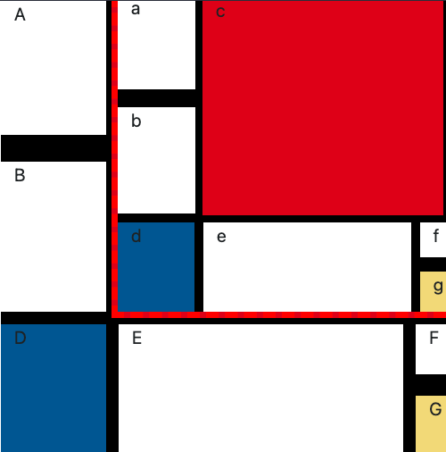

# Mondrian inside Mondrian with Bootstrap

## A reproduction of a Mondrian painting using Bootstrap CSS

## Taken from a project as part of the "Learn Bootstrap" Course at [https://www.codecademy.com/learn]

The tricky part was adding another Mondrian in the div labeled 'c'.

### View the project live at [mondrian-inside-mondrian-with-bootsrap](https://exarp1.github.io/mondrian-inside-mondrian-with-bootstrap)

